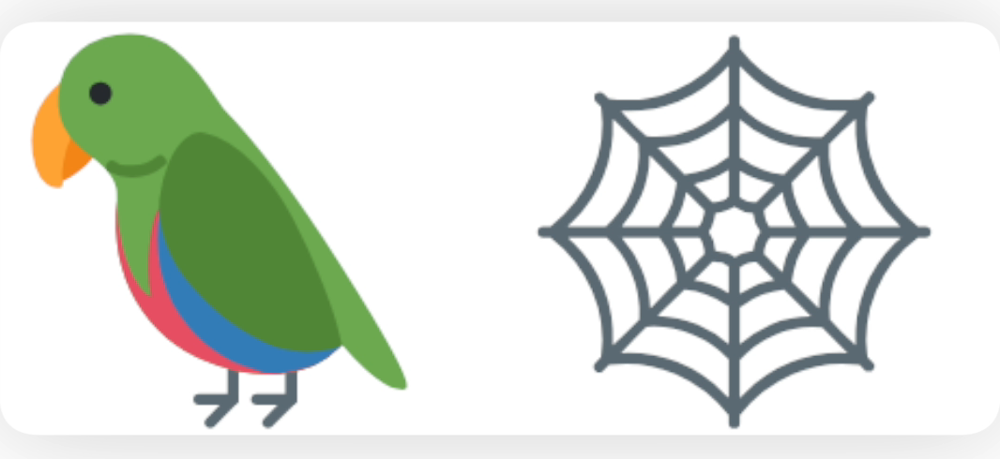

# LangGraph 
 

LangGraph is an open-source framework for building knowledge graphs by integrating natural language processing (NLP) and large language models (LLMs). It allows developers to extract, analyze, and structure data into interconnected nodes and edges for complex applications like search, recommendation, and semantic reasoning. LangGraph supports flexible data ingestion, enabling the integration of unstructured text, APIs, and databases into graph-based models. Its modular architecture includes tools for entity recognition, relationship extraction, and graph visualization. It is widely used for tasks in knowledge representation, question answering, and domain-specific graph creation.

# Core pillars support

  - controllability
  - Persistance
  - Human-in-the-loop
  - Streaming

# Graph & State Machine

A Graph is used to describe the relationships. A state machine consists of states where there are transitions form one state to another state.States are represented as nodes and transiions are represented as edges.

