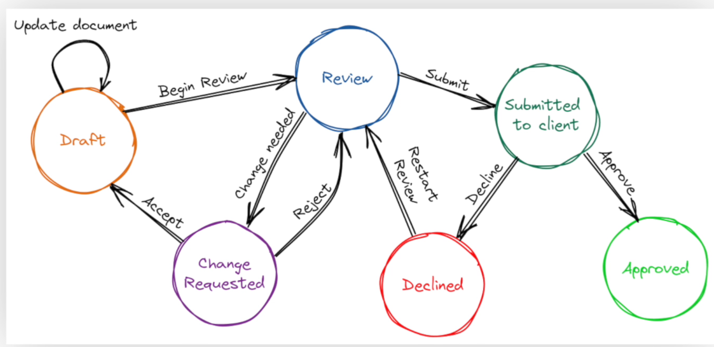

# LangGraph 
 

LangGraph is an open-source framework for building knowledge graphs by integrating natural language processing (NLP) and large language models (LLMs). It allows developers to extract, analyze, and structure data into interconnected nodes and edges for complex applications like search, recommendation, and semantic reasoning. LangGraph supports flexible data ingestion, enabling the integration of unstructured text, APIs, and databases into graph-based models. Its modular architecture includes tools for entity recognition, relationship extraction, and graph visualization. It is widely used for tasks in knowledge representation, question answering, and domain-specific graph creation.

# Core pillars support

  - controllability
  - Persistance
  - Human-in-the-loop
  - Streaming

# Graph & State Machine

A Graph is used to describe the relationships. A state machine consists of states where there are transitions form one state to another state.States are represented as nodes and transiions are represented as edges.

# Flow Engineering

Flow Engineering in LangGraph refers to designing, managing, and optimizing workflows or pipelines within the LangGraph framework. LangGraph is typically used for creating language or AI-based systems that integrate modular components to solve complex problems. Here's how flow engineering can be conceptualized and applied in LangGraph:

## What is Flow Engineering in LangGraph?

## Flow Engineering involves:

### Mapping Tasks to Nodes: 
Representing individual steps in a workflow as nodes in the LangGraph.
### Defining Edges: 
Establishing directed connections that represent the flow of data or control between nodes.
### Orchestrating Dependencies: 
Ensuring nodes execute in the correct order based on input-output dependencies.
### Handling Data Transformation: 
Managing transformations as data flows through nodes.

## Components of LangGraph Flow Engineering

### Nodes:
Represent discrete tasks (e.g., language model prompts, data cleaning, summarization).
Each node can have inputs, logic, and outputs.

### Edges:
Define relationships between nodes.
Can include conditions, error-handling flows, or parallel paths.

### Flow Controls:
Implement control mechanisms such as branching, looping, or retries.
Use triggers to activate specific parts of the graph.

### Execution Context:
Track the state, configurations, and metadata throughout the workflow.

